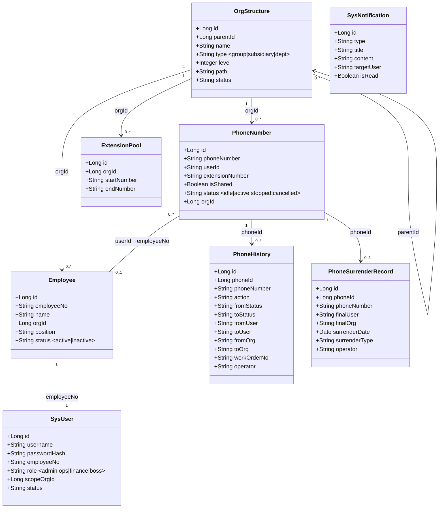
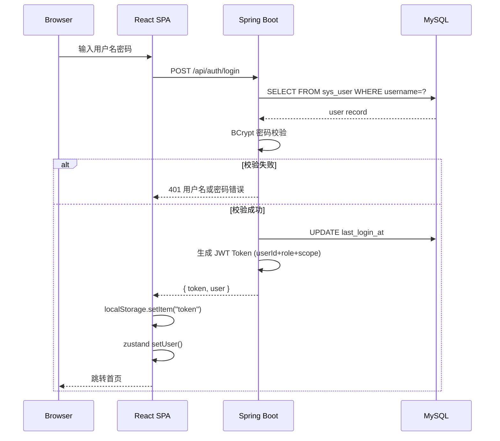
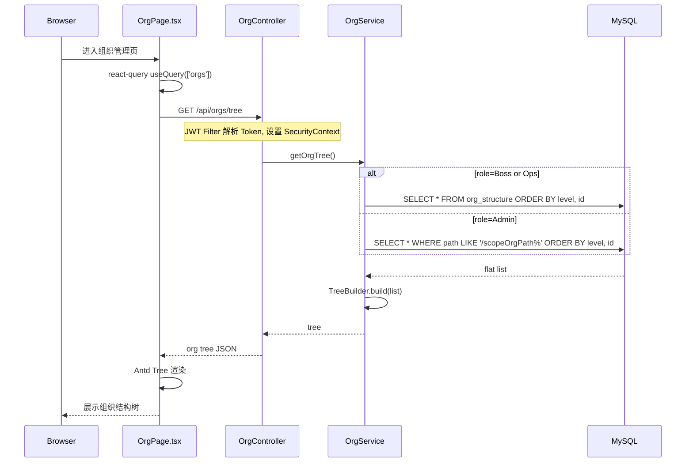
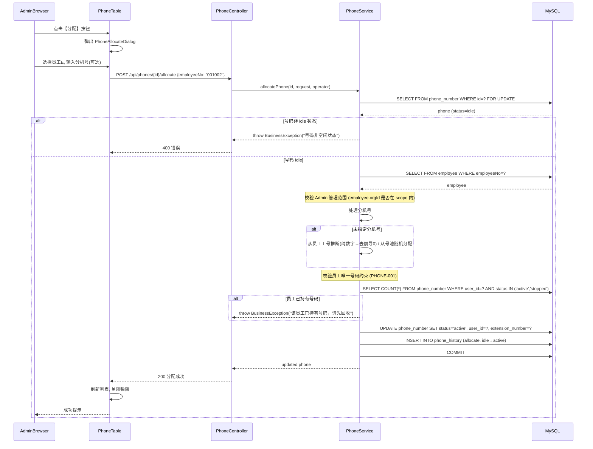
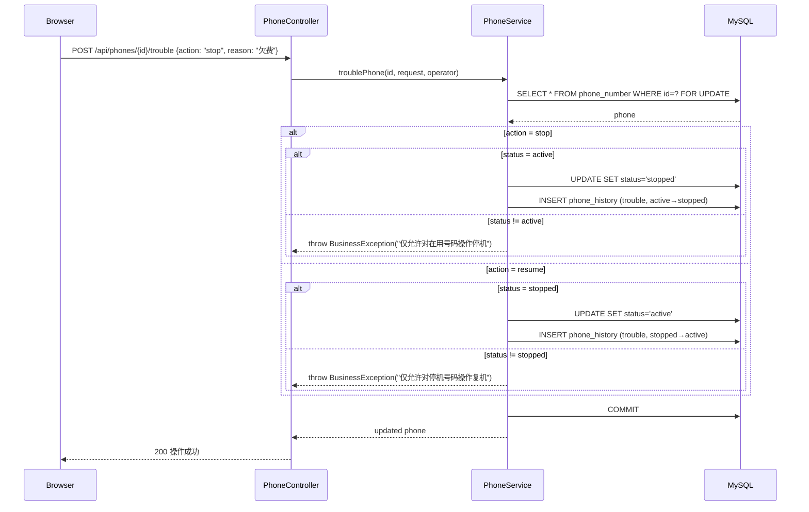
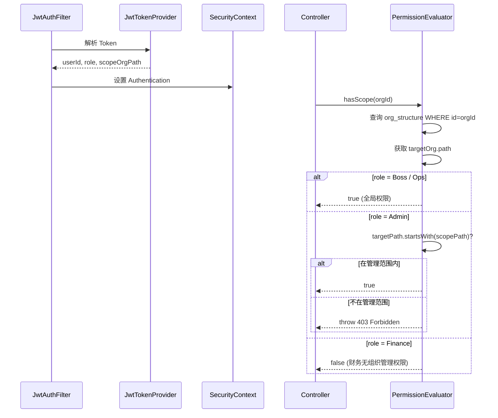

# PhoneBiz Phase 1 系统架构设计

> 架构师：高见远（Gao） | 日期：2026-05-10 | 版本：1.0
> 基于 PRD v1.0 / 业务规则清单 v1.0 / DDL v1.0

---

## 一、实现方案 + 框架选型

### 1.1 整体架构

```
┌─────────────────────────────────────────────────────────┐
│                    浏览器（React SPA）                    │
│                  Vite + React 18 + Antd 5                │
│                         axios                           │
├─────────────────────────────────────────────────────────┤
│                     Nginx (80)                          │
│              / → 静态资源  /api → 反向代理                │
├─────────────────────────────────────────────────────────┤
│               Spring Boot 3.2 (8080)                    │
│         REST API + JWT Auth + RBAC 权限                  │
│              JPA/Hibernate + MySQL 8                    │
└─────────────────────────────────────────────────────────┘
```

### 1.2 技术选型明细

| 层级 | 技术 | 版本 | 说明 |
|------|------|------|------|
| 前端框架 | React | 18.2.x | 函数组件 + Hooks |
| 构建工具 | Vite | 5.x | 快速 HMR |
| UI 组件库 | Ant Design | 5.12.x | 中文生态好，树/表格/表单成熟 |
| 路由 | react-router-dom | 6.21.x | 嵌套路由 |
| 状态管理 | zustand | 4.4.x | 轻量，比 Redux 简单 |
| 数据请求 | @tanstack/react-query | 5.x | 缓存/刷新/乐观更新 |
| HTTP 客户端 | axios | 1.6.x | 拦截器处理 JWT |
| 后端框架 | Spring Boot | 3.2.0 | Java 17+ |
| ORM | Spring Data JPA | (SB内置) | Hibernate 6 |
| 安全 | Spring Security + JWT | 0.12.3 (jjwt) | 无状态认证 |
| 参数校验 | Jakarta Validation | (SB内置) | DTO 校验 |
| API 文档 | springdoc-openapi | 2.3.0 | Swagger UI |
| 数据库 | MySQL | 8.0 | utf8mb4 |
| 简化工具 | Lombok | 1.18.30 | 减少样板代码 |
| 对象映射 | MapStruct | 1.5.5 | Entity ↔ DTO |

### 1.3 项目根目录结构

```
/Users/admin/WorkBuddy/20260510需求/
├── backend/                    # Spring Boot 后端
│   ├── build.gradle
│   ├── settings.gradle
│   └── src/
│       ├── main/java/com/phonebiz/
│       └── main/resources/
├── frontend/                   # React Vite 前端
│   ├── package.json
│   ├── vite.config.ts
│   └── src/
├── db/
│   └── init.sql               # 已存在 DDL 可直接复用
├── docs/
│   ├── PhoneBiz需求文档_v1.0.md
│   ├── PhoneBiz业务规则清单.md
│   ├── PhoneBiz数据库设计_DDL.sql
│   └── PhoneBiz-Phase1-架构设计.md  (本文档)
└── deploy/
    └── docker-compose.yml      # 可选本地部署
```

---

## 二、文件列表及相对路径

### 2.1 后端 (backend/src/main/java/com/phonebiz/)

#### 入口与配置
| 文件 | 说明 |
|------|------|
| `PhoneBizApplication.java` | Spring Boot 入口 |
| `config/SecurityConfig.java` | Spring Security 配置 |
| `config/CorsConfig.java` | 跨域配置 |
| `config/JwtConfig.java` | JWT 配置属性 |
| `config/DataInitializer.java` | 初始化数据（admin 账号等） |

#### 公共模块 (common/)
| 文件 | 说明 |
|------|------|
| `common/ApiResponse.java` | 统一响应体 `{code, message, data}` |
| `common/PageResult.java` | 分页响应 `{list, total, page, size}` |
| `common/ResultCode.java` | 响应码枚举（SUCCESS/ERROR/UNAUTHORIZED/...） |
| `common/BaseEntity.java` | 实体基类（createdAt, updatedAt, createdBy, updatedBy） |

#### 异常 (exception/)
| 文件 | 说明 |
|------|------|
| `exception/BusinessException.java` | 业务异常 |
| `exception/ErrorCode.java` | 错误码枚举 |
| `exception/GlobalExceptionHandler.java` | 全局异常处理 @ControllerAdvice |

#### 安全 (security/)
| 文件 | 说明 |
|------|------|
| `security/JwtTokenProvider.java` | JWT 生成/解析/验证 |
| `security/JwtAuthenticationFilter.java` | 请求拦截 → 提取 Token → 设 SecurityContext |
| `security/UserDetailsServiceImpl.java` | 加载用户信息 & 权限 |
| `security/PermissionEvaluator.java` | Admin 管理范围判断（按 org path） |

#### 实体 (entity/)
| 文件 | 对应表 |
|------|--------|
| `entity/OrgStructure.java` | org_structure |
| `entity/Employee.java` | employee |
| `entity/PhoneNumber.java` | phone_number |
| `entity/ExtensionPool.java` | extension_pool |
| `entity/PhoneHistory.java` | phone_history |
| `entity/PhoneSurrenderRecord.java` | phone_surrender_record |
| `entity/SysUser.java` | sys_user |
| `entity/SysNotification.java` | sys_notification |

#### 数据访问 (repository/)
| 文件 | 说明 |
|------|------|
| `repository/OrgRepository.java` | JpaRepository + 自定义查询 |
| `repository/EmployeeRepository.java` | 按 org path LIKE 查询 |
| `repository/PhoneRepository.java` | 状态过滤 + 分页 |
| `repository/PhoneHistoryRepository.java` | 按 phone_id + 时间倒序 |
| `repository/PhoneSurrenderRecordRepository.java` | 拆机归档查询 |
| `repository/ExtensionPoolRepository.java` | 按 org_id 查询 |
| `repository/SysUserRepository.java` | 按 username 查询 |
| `repository/SysNotificationRepository.java` | 按 target_user 查询 |

#### DTO (dto/)
| 文件 | 说明 |
|------|------|
| `dto/request/LoginRequest.java` | username + password |
| `dto/request/OrgRequest.java` | name, type, parentId |
| `dto/request/EmployeeRequest.java` | employeeNo, name, orgId, position, phone, email, entryDate |
| `dto/request/PhoneAllocateRequest.java` | employeeNo, extensionNumber (可选) |
| `dto/request/PhoneReclaimRequest.java` | reason |
| `dto/request/PhoneTroubleRequest.java` | action(stop/resume), reason |
| `dto/request/PhoneSurrenderRequest.java` | reason |
| `dto/request/PhoneChangeUserRequest.java` | newEmployeeNo |
| `dto/request/PhoneChangeNumberRequest.java` | newPhoneNumber, newExtensionNumber(可选) |
| `dto/request/PhoneChangeOrgRequest.java` | newOrgId, reason |
| `dto/request/PhoneAddRequest.java` | phoneNumber, orgId, extensionNumber |
| `dto/request/ExtensionPoolRequest.java` | orgId, startNumber, endNumber |
| `dto/request/UserRequest.java` | username, password, employeeNo, role |
| `dto/response/LoginResponse.java` | token, userInfo |
| `dto/response/UserInfoResponse.java` | id, username, employeeNo, role, scopeOrgId |
| `dto/response/OrgTreeResponse.java` | id, name, type, children[] |
| `dto/response/EmployeeResponse.java` | 员工完整信息 |
| `dto/response/PhoneResponse.java` | 号码 + 使用人 + 组织信息 |
| `dto/response/PhoneHistoryResponse.java` | 操作历史记录 |
| `dto/response/PhoneSurrenderResponse.java` | 拆机归档记录 |

#### 控制器 (controller/)
| 文件 | 端点 |
|------|------|
| `controller/AuthController.java` | /api/auth/** |
| `controller/OrgController.java` | /api/orgs/** |
| `controller/EmployeeController.java` | /api/employees/** |
| `controller/PhoneController.java` | /api/phones/** |
| `controller/ExtensionPoolController.java` | /api/ext-pools/** |
| `controller/UserController.java` | /api/users/** |

#### 服务 (service/)
| 文件 | 说明 |
|------|------|
| `service/AuthService.java` | 登录/登出/获取当前用户 |
| `service/OrgService.java` | 组织 CRUD + 树构建 |
| `service/EmployeeService.java` | 员工 CRUD + 工号规则校验 |
| `service/PhoneService.java` | 号码 CRUD + 状态变更(allocate/reclaim/trouble/surrender/changeUser/changeNumber/changeOrg) + 历史记录 + 通知 |
| `service/ExtensionPoolService.java` | 分机号池 CRUD + 自动分配 |
| `service/UserService.java` | 用户 CRUD |
| `service/NotificationService.java` | 系统消息发送 |

#### 工具 (util/)
| 文件 | 说明 |
|------|------|
| `util/PhoneNumberGenerator.java` | 分机号随机生成（6位数字，不含前导0） |
| `util/TreeBuilder.java` | 将平铺 org 列表构建为树结构 |
| `util/EmployeeNoValidator.java` | 工号格式校验（6位，字母或数字） |

### 2.2 前端 (frontend/src/)

#### 入口与配置
| 文件 | 说明 |
|------|------|
| `main.tsx` | React 入口 |
| `App.tsx` | 路由定义 |
| `vite-env.d.ts` | 类型声明 |

#### 类型定义 (types/)
| 文件 | 说明 |
|------|------|
| `types/index.ts` | 全量 TS 类型/接口定义 |

#### API 层 (api/)
| 文件 | 说明 |
|------|------|
| `api/client.ts` | axios 实例（baseURL, JWT 拦截器, 401 处理） |
| `api/auth.ts` | login(), logout(), getMe() |
| `api/org.ts` | getTree(), create(), update(), delete() |
| `api/employee.ts` | list(), create(), update(), delete() |
| `api/phone.ts` | list(), getDetail(), allocate(), reclaim(), trouble(), surrender(), changeUser(), changeNumber(), changeOrg(), getHistory() |
| `api/extensionPool.ts` | listByOrg(), create(), update(), delete() |
| `api/user.ts` | list(), create(), updateStatus() |

#### 状态管理 (stores/)
| 文件 | 说明 |
|------|------|
| `stores/authStore.ts` | zustand: user, token, login, logout |
| `stores/orgStore.ts` | zustand: orgTree, selectedOrg |

#### 工具 (utils/)
| 文件 | 说明 |
|------|------|
| `utils/auth.ts` | token 读写（localStorage） |
| `utils/tree.ts` | 构建树形数据、查找节点 |

#### 布局 (components/layout/)
| 文件 | 说明 |
|------|------|
| `AppLayout.tsx` | Antd Layout: Sider + Header + Content |
| `Sidebar.tsx` | 左侧菜单（根据角色显示） |
| `Header.tsx` | 用户信息 + 退出 |

#### 通用组件 (components/common/)
| 文件 | 说明 |
|------|------|
| `Loading.tsx` | 加载骨架屏 |
| `Empty.tsx` | 空状态占位 |
| `ConfirmDialog.tsx` | 操作确认弹窗 |
| `StatusBadge.tsx` | 状态标签（idle/active/stopped/cancelled） |

#### 登录 (components/auth/)
| 文件 | 说明 |
|------|------|
| `LoginForm.tsx` | 用户名+密码表单 |

#### 组织管理 (components/org/)
| 文件 | 说明 |
|------|------|
| `OrgTree.tsx` | Antd Tree 组件 |
| `OrgFormDialog.tsx` | 新增/编辑 组织 Modal |

#### 员工管理 (components/employee/)
| 文件 | 说明 |
|------|------|
| `EmployeeTable.tsx` | Antd Table + 分页 + 搜索 |
| `EmployeeFormDialog.tsx` | 新增/编辑员工 Modal |
| `EmployeeSearchBar.tsx` | 搜索栏组件 |

#### 电话管理 (components/phone/)
| 文件 | 说明 |
|------|------|
| `PhoneTable.tsx` | 号码列表 + 操作按钮 |
| `PhoneDetail.tsx` | 号码详情（含历史记录） |
| `PhoneOperationBar.tsx` | 操作按钮组（按状态显示） |
| `PhoneAllocateDialog.tsx` | 分配号码 Modal |
| `PhoneReclaimDialog.tsx` | 回收号码 Modal |
| `PhoneTroubleDialog.tsx` | 停机/复机 Modal |
| `PhoneSurrenderDialog.tsx` | 拆机确认 Modal |
| `PhoneChangeUserDialog.tsx` | 过户 Modal |
| `PhoneChangeNumberDialog.tsx` | 换号 Modal |
| `PhoneChangeOrgDialog.tsx` | 转移 Modal |
| `PhoneHistoryList.tsx` | 操作历史时间线 |
| `PhoneStatusBadge.tsx` | 号码状态标签颜色映射 |

#### 分机号池 (components/extensionPool/)
| 文件 | 说明 |
|------|------|
| `ExtensionPoolTable.tsx` | 号池列表 |
| `ExtensionPoolFormDialog.tsx` | 新增/编辑号池 Modal |

#### 页面 (pages/)
| 文件 | 说明 |
|------|------|
| `LoginPage.tsx` | 登录页 |
| `Dashboard.tsx` | 首页/仪表盘 |
| `OrgPage.tsx` | 组织管理页 |
| `EmployeePage.tsx` | 员工管理页 |
| `PhonePage.tsx` | 号码管理页（含详情抽屉） |
| `ExtensionPoolPage.tsx` | 分机号池管理页 |

---

## 三、数据结构与接口设计

### 3.1 实体类关系图（Mermaid 类图）



### 3.2 REST API 设计

#### 3.2.1 认证接口

| 方法 | 路径 | 说明 | 权限 |
|------|------|------|------|
| POST | /api/auth/login | 登录 | 公开 |
| POST | /api/auth/logout | 登出 | 已登录 |
| GET | /api/auth/me | 当前用户信息 | 已登录 |

**登录请求/响应：**

```json
// POST /api/auth/login
// Request
{ "username": "admin01", "password": "xxx" }

// Response
{
  "code": 200,
  "message": "success",
  "data": {
    "token": "eyJhbGci...",
    "user": {
      "id": 1,
      "username": "admin01",
      "employeeNo": "001001",
      "role": "admin",
      "name": "张三",
      "orgId": 1,
      "orgName": "集团总部",
      "scopeOrgPath": "/1/"
    }
  }
}
```

#### 3.2.2 组织管理

| 方法 | 路径 | 说明 | 权限 |
|------|------|------|------|
| GET | /api/orgs/tree | 组织树（全量或按 scope 裁剪） | 已登录 |
| GET | /api/orgs/{id} | 单个组织详情 | 已登录 |
| POST | /api/orgs | 新增组织 | Admin(Boss可) |
| PUT | /api/orgs/{id} | 编辑组织 | Admin(本scope) |
| DELETE | /api/orgs/{id} | 删除组织（无子节点+无员工时） | Admin(本scope) |

**组织树响应：**

```json
// GET /api/orgs/tree
{
  "code": 200,
  "data": [
    {
      "id": 1,
      "name": "集团总部",
      "type": "group",
      "level": 0,
      "children": [
        {
          "id": 2,
          "name": "子公司A",
          "type": "subsidiary",
          "level": 1,
          "children": [
            { "id": 3, "name": "技术部", "type": "dept", "level": 2, "children": [] },
            { "id": 4, "name": "财务部", "type": "dept", "level": 2, "children": [] }
          ]
        }
      ]
    }
  ]
}
```

#### 3.2.3 员工管理

| 方法 | 路径 | 说明 | 权限 |
|------|------|------|------|
| GET | /api/employees | 员工列表（分页+搜索+按组织过滤） | Admin(scope) |
| GET | /api/employees/{id} | 员工详情 | Admin(scope) |
| POST | /api/employees | 新增员工 | Admin(scope) |
| PUT | /api/employees/{id} | 编辑员工 | Admin(scope) |
| DELETE | /api/employees/{id} | 离职处理(标记 inactive) | Admin(scope) |

**查询参数：** `?page=1&size=20&keyword=张三&orgId=3&status=active`

#### 3.2.4 号码管理（核心）

| 方法 | 路径 | 说明 | 权限 |
|------|------|------|------|
| GET | /api/phones | 号码列表（分页+状态过滤+组织过滤） | Admin(scope)+Ops |
| GET | /api/phones/{id} | 号码详情（含历史记录） | Admin+Ops |
| POST | /api/phones | 新增号码到号码池 | Ops |
| POST | /api/phones/{id}/allocate | 分配号码 | Admin(scope) |
| POST | /api/phones/{id}/reclaim | 回收号码 | Admin(scope) |
| POST | /api/phones/{id}/trouble | 停机/复机 | Admin(scope)+Ops |
| POST | /api/phones/{id}/surrender | 拆机 | Admin(scope)+Ops |
| POST | /api/phones/{id}/change-user | 过户 | Admin(scope) |
| POST | /api/phones/{id}/change-number | 换号（分配新号码+旧号码回池） | Admin(scope) |
| POST | /api/phones/{id}/change-org | 转移（变更归属部门） | Admin(scope) |
| GET | /api/phones/{id}/history | 操作历史 | Admin+Ops |
| GET | /api/phones/surrendered | 已拆机列表（分页） | Admin+Ops |

**号码操作请求体：**

```json
// allocate - 分配号码
{ "employeeNo": "001002", "extensionNumber": "100086" }

// reclaim - 回收
{ "reason": "员工离职" }

// trouble - 停机/复机
{ "action": "stop", "reason": "欠费暂停" }
// 或 { "action": "resume", "reason": "已缴费" }

// surrender - 拆机
{ "reason": "合同到期归还运营商" }

// change-user - 过户
{ "newEmployeeNo": "001003" }

// change-number - 换号
{ "newPhoneNumber": "010-88880002", "newExtensionNumber": "100088" }

// change-org - 转移
{ "newOrgId": 5, "reason": "部门调整" }
```

#### 3.2.5 分机号池

| 方法 | 路径 | 说明 | 权限 |
|------|------|------|------|
| GET | /api/ext-pools | 号池列表（按部门） | Ops+Boss |
| POST | /api/ext-pools | 新增号池范围 | Ops |
| PUT | /api/ext-pools/{id} | 编辑号池范围 | Ops |
| DELETE | /api/ext-pools/{id} | 删除号池 | Ops |

#### 3.2.6 用户管理

| 方法 | 路径 | 说明 | 权限 |
|------|------|------|------|
| GET | /api/users | 用户列表 | Admin(scope) |
| POST | /api/users | 创建用户 | Admin(scope) |
| PUT | /api/users/{id}/status | 启用/禁用 | Admin(scope) |

---

## 四、程序调用流程（Mermaid 时序图）

### 4.1 用户登录流程



### 4.2 组织架构 CRUD 流程（树查询）



### 4.3 号码分配流程（allocate）



### 4.4 号码状态变更流程（trouble 停复机）



### 4.5 Admin 权限范围查询流程



---

## 五、任务列表

### 分组 A：项目骨架 + 基础设施

| 编号 | 任务 | 涉及文件 | 前置 | 说明 |
|------|------|----------|------|------|
| T-001 | 后端项目骨架 | build.gradle, settings.gradle, PhoneBizApplication, application.yml | - | Gradle 项目 + 依赖 + MySQL 连接配置 |
| T-002 | 前端项目骨架 | package.json, vite.config.ts, main.tsx, App.tsx, index.html | - | Vite + React + Antd + 路由框架 |
| T-003 | 公共模块 | ApiResponse, PageResult, ResultCode, BaseEntity | - | 统一响应格式 |
| T-004 | 异常处理 | BusinessException, ErrorCode, GlobalExceptionHandler | T-003 | 全局 @ControllerAdvice |
| T-005 | DDL 初始化 | init.sql (复用到 MySQL) | - | 执行已有 DDL，创建 database + 表 |

### 分组 B：安全与认证

| 编号 | 任务 | 涉及文件 | 前置 | 说明 |
|------|------|----------|------|------|
| T-006 | JWT 基础设施 | JwtConfig, JwtTokenProvider | T-003 | Token 生成/解析/验证 |
| T-007 | Security 配置 | SecurityConfig, CorsConfig | T-006 | Spring Security + JWT Filter |
| T-008 | UserDetails 加载 | UserDetailsServiceImpl, SysUser, SysUserRepository | T-005, T-006 | 从 DB 加载用户权限 |
| T-009 | 登录/登出接口 | AuthController, AuthService, LoginRequest, LoginResponse, LoginForm.tsx | T-007, T-008 | 完整认证闭环 |
| T-010 | 前端认证集成 | authStore, utils/auth, api/client | T-002 | zustand + axios 拦截器 |

### 分组 C：组织架构管理

| 编号 | 任务 | 涉及文件 | 前置 | 说明 |
|------|------|----------|------|------|
| T-011 | Org 后端 CRUD | OrgStructure, OrgRepository, OrgService, OrgController, OrgRequest, OrgTreeResponse | T-005 | 组织增删改查 |
| T-012 | TreeBuilder | TreeBuilder.java | T-011 | 平铺列表 → 树 |
| T-012b | Org path/level 自动计算 | OrgService 插入/移动时计算 path=parent.path+id+"/", level=parent.level+1 | T-011 | 组织节点变更时自动维护 path 和 level |
| T-013 | Org 权限范围裁剪 | PermissionEvaluator, OrgService 追加 scope 过滤 | T-011, T-008 | Admin 只能看管理范围 |
| T-014 | Org 前端页面 | OrgPage, OrgTree, OrgFormDialog | T-010, T-011 | Antd Tree + Modal |

### 分组 D：员工管理

| 编号 | 任务 | 涉及文件 | 前置 | 说明 |
|------|------|----------|------|------|
| T-015 | Employee 后端 CRUD | Employee, EmployeeRepository, EmployeeService, EmployeeController | T-005 | 员工增删改查 |
| T-016 | 工号校验与分机号生成 | EmployeeNoValidator, PhoneNumberGenerator | T-015 | 纯数字→分机号=工号去前导0 |
| T-016b | 员工创建联动用户 | EmployeeService 创建时自动生成 SysUser（默认密码，首次登录强制修改） | T-015, T-032 | 创建员工 → 自动创建同名账号 |
| T-017 | Employee 前端页面 | EmployeePage, EmployeeTable, EmployeeFormDialog | T-010, T-015 | 表格+搜索+分页 |

### 分组 E：电话目录管理（核心）

| 编号 | 任务 | 涉及文件 | 前置 | 说明 |
|------|------|----------|------|------|
| T-018 | Phone 实体 + Repository | PhoneNumber, PhoneRepository | T-005 | 基础查询（状态/组织/用户） |
| T-019 | Phone 查询接口 | PhoneService (list/get), PhoneController GET | T-018 | 号码列表+详情 |
| T-020 | Phone allocate 流程 | PhoneService.allocate(), PhoneAllocateRequest | T-018, T-016 | 状态闲置→在用 + 校验目标员工无现有号码 + 历史记录 |
| T-020a | allocate 员工唯一号码约束 | PhoneService 分配前校验 target employee 是否已持有 active/stopped 号码 | T-020 | 业务规则 PHONE-001："每个员工最多1个号码" |
| T-021 | Phone reclaim 流程 | PhoneService.reclaim() | T-020 | 在用→闲置 + 历史 |
| T-022 | Phone trouble 流程 | PhoneService.trouble() | T-020 | 在用⇌停机 + 历史 |
| T-023 | Phone surrender 流程 | PhoneService.surrender(), PhoneSurrenderRecord, PhoneSurrenderRecordRepository | T-020 | 任意→已拆机 + 归档 |
| T-024 | Phone change-user 流程 | PhoneService.changeUser() | T-020 | 过户（使用人变更） |
| T-024b | Phone change-number 流程 | PhoneService.changeNumber(), PhoneChangeNumberRequest | T-020 | 换号：旧号码→idle + 新号码→active（事务） |
| T-024c | Phone change-org 流程 | PhoneService.changeOrg(), PhoneChangeOrgRequest | T-020 | 转移：变更号码归属部门 |
| T-025 | Phone 历史记录 | PhoneHistory, PhoneHistoryRepository, PhoneHistoryResponse | T-018 | 独立查询接口 |
| T-025b | 号码操作通知 | NotificationService（sys_notification 插入） | T-005, T-020 | allocate/reclaim/trouble 等操作后推送系统消息 |
| T-026 | Phone 前端页面 | PhonePage, PhoneTable, PhoneDetail, PhoneStatusBadge | T-010, T-019 | 状态过滤+操作入口 |
| T-027 | Phone 操作弹窗 | allocate/reclaim/trouble/surrender/changeUser Dialogs | T-026, T-020~T-024 | 各操作 Modal 表单 |
| T-027b | Phone 换号/转移弹窗 | PhoneChangeNumberDialog, PhoneChangeOrgDialog | T-026, T-024b, T-024c | 换号 + 转移 Modal |
| T-028 | Phone 历史前端 | PhoneHistoryList (时间线) | T-025, T-026 | 号码详情内的历史时间线 |

### 分组 F：分机号池管理

| 编号 | 任务 | 涉及文件 | 前置 | 说明 |
|------|------|----------|------|------|
| T-029 | ExtensionPool 后端 CRUD | ExtensionPool, ExtensionPoolRepository, ExtensionPoolService, ExtensionPoolController | T-005 | 按部门管理号池范围 |
| T-030 | 自动分机号分配 | PhoneService 集成号池分配逻辑 | T-029, T-016 | 含字母工号 → 从号池随机分配 |
| T-031 | ExtensionPool 前端页面 | ExtensionPoolPage, ExtensionPoolTable, ExtensionPoolFormDialog | T-010, T-029 | 号池列表+编辑 |

### 分组 G：用户管理

| 编号 | 任务 | 涉及文件 | 前置 | 说明 |
|------|------|----------|------|------|
| T-032 | User 后端 CRUD | SysUser, UserService, UserController | T-005 | 创建+启用/禁用 |
| T-033 | 数据初始化 | DataInitializer | T-005 | 初始化种子数据（admin/boss/ops账号） |

### 分组 H：权限与控制

| 编号 | 任务 | 涉及文件 | 前置 | 说明 |
|------|------|----------|------|------|
| T-034 | 后端方法级权限 | @PreAuthorize + PermissionEvaluator | T-013 | Controller 方法注解 |
| T-035 | 前端菜单权限 | Sidebar + 角色判断 | T-010, T-009 | 按 role 显示/隐藏菜单项 |
| T-036 | 前端操作权限 | PhoneOperationBar 按钮状态 | T-027, T-035 | 按角色+号码状态控制按钮可用性 |

### 分组 I：部署与集成测试

| 编号 | 任务 | 涉及文件 | 前置 | 说明 |
|------|------|----------|------|------|
| T-037 | 前端构建配置 | vite.config.ts (proxy) | T-002 | 开发代理 /api → localhost:8080 |
| T-038 | 部署脚本 | docker-compose.yml, deploy.sh | T-001, T-037 | 本地一键启动 |
| T-039 | 全流程联调测试 | 全部 | T-001~T-038 | 端到端验证 |

### 任务依赖图 (DAG)

```
T-001 ──┬── T-005 ──┬── T-011 ── T-012 ── T-012b ── T-013 ── T-014
        │            │
T-003 ──┤            ├── T-015 ── T-016 ── T-016b ── T-017
        │            │
T-004 ──┤            ├── T-018 ── T-019 ── T-026 ── T-027 ── T-027b
        │            │               │
T-006 ── T-007 ── T-008 ── T-009    ├── T-020 ── T-020a
        │                         ├── T-021
T-002 ── T-010                      ├── T-022
                                    ├── T-023
                                    ├── T-024
                                    ├── T-024b
                                    ├── T-024c
                                    └── T-025 ── T-028
                                               └── T-025b (并行)

T-011 ── T-013 ── T-034

T-029 ── T-030 ── T-031

T-005 ── T-032 ── T-033

T-009 ── T-035 ── T-036

T-001 ── T-038
T-002 ── T-037

ALL ── T-039
```

> **总任务数**：39 → **47 项**（新增 8 项）

---

## 六、依赖包列表

### 6.1 后端 Gradle 依赖

```groovy
// build.gradle
plugins {
    id 'java'
    id 'org.springframework.boot' version '3.2.0'
    id 'io.spring.dependency-management' version '1.1.4'
}

java { sourceCompatibility = '17' }

repositories { mavenCentral() }

dependencies {
    // Spring Boot 核心
    implementation 'org.springframework.boot:spring-boot-starter-web'
    implementation 'org.springframework.boot:spring-boot-starter-data-jpa'
    implementation 'org.springframework.boot:spring-boot-starter-security'
    implementation 'org.springframework.boot:spring-boot-starter-validation'

    // MySQL
    runtimeOnly 'com.mysql:mysql-connector-j:8.0.33'

    // JWT
    implementation 'io.jsonwebtoken:jjwt-api:0.12.3'
    runtimeOnly 'io.jsonwebtoken:jjwt-impl:0.12.3'
    runtimeOnly 'io.jsonwebtoken:jjwt-jackson:0.12.3'

    // Lombok
    compileOnly 'org.projectlombok:lombok:1.18.30'
    annotationProcessor 'org.projectlombok:lombok:1.18.30'

    // MapStruct
    implementation 'org.mapstruct:mapstruct:1.5.5.Final'
    annotationProcessor 'org.mapstruct:mapstruct-processor:1.5.5.Final'

    // Swagger
    implementation 'org.springdoc:springdoc-openapi-starter-webmvc-ui:2.3.0'

    // Test
    testImplementation 'org.springframework.boot:spring-boot-starter-test'
    testImplementation 'org.springframework.security:spring-security-test'
}
```

### 6.2 前端 npm 依赖

```json
{
  "dependencies": {
    "react": "^18.2.0",
    "react-dom": "^18.2.0",
    "react-router-dom": "^6.21.0",
    "antd": "^5.12.0",
    "@ant-design/icons": "^5.2.6",
    "axios": "^1.6.0",
    "zustand": "^4.4.0",
    "@tanstack/react-query": "^5.17.0",
    "dayjs": "^1.11.10"
  },
  "devDependencies": {
    "@types/react": "^18.2.43",
    "@types/react-dom": "^18.2.17",
    "@vitejs/plugin-react": "^4.2.1",
    "typescript": "^5.3.3",
    "vite": "^5.0.8"
  }
}
```

---

## 七、共享知识

### 7.1 命名规范

| 类别 | 规范 | 示例 |
|------|------|------|
| Java 包名 | 小写，com.phonebiz.{module} | com.phonebiz.controller |
| Java 类名 | 大驼峰 | PhoneService, OrgController |
| Java 方法 | 小驼峰，动词开头 | allocatePhone(), getOrgTree() |
| 数据库表 | 小写+下划线 | phone_number, work_order |
| 数据库列 | 小写+下划线 | created_at, employee_no |
| REST 路径 | 小写复数 | /api/phones, /api/orgs |
| REST 操作 | 嵌套资源 | /api/phones/{id}/allocate |
| TS 文件 | 小驼峰 | authStore.ts, phoneTable.tsx |
| TS 组件 | 大驼峰 PascalCase | PhoneTable, OrgTree |
| TS 接口 | I 前缀或直接大驼峰 | IPhone, EmployeeResponse |

### 7.2 统一响应格式

```json
// 成功
{ "code": 200, "message": "success", "data": {...} }

// 分页
{ "code": 200, "message": "success", "data": { "list": [...], "total": 100, "page": 1, "size": 20 } }

// 业务错误
{ "code": 400, "message": "号码非空闲状态，无法分配" }

// 认证错误
{ "code": 401, "message": "Token 已过期，请重新登录" }

// 权限错误
{ "code": 403, "message": "无权限操作该资源" }

// 系统错误
{ "code": 500, "message": "服务器内部错误" }
```

### 7.3 前端 API 调用约定

```typescript
// api/client.ts
const client = axios.create({ baseURL: '/api', timeout: 10000 })

// 请求拦截器：自动附加 JWT
client.interceptors.request.use(config => {
  const token = localStorage.getItem('token')
  if (token) config.headers.Authorization = `Bearer ${token}`
  return config
})

// 响应拦截器：统一错误处理
client.interceptors.response.use(
  res => res.data,
  err => {
    if (err.response?.status === 401) {
      localStorage.removeItem('token')
      window.location.href = '/login'
    }
    return Promise.reject(err.response?.data || err)
  }
)
```

### 7.4 统一异常处理策略

后端所有 Service 层抛出自定义异常 `BusinessException(code, message)`，由 `GlobalExceptionHandler` 统一转换为标准 JSON 响应：

```java
@RestControllerAdvice
public class GlobalExceptionHandler {
    @ExceptionHandler(BusinessException.class)
    public ApiResponse<?> handleBusiness(BusinessException e) { ... }

    @ExceptionHandler(MethodArgumentNotValidException.class)
    public ApiResponse<?> handleValidation(MethodArgumentNotValidException e) { ... }

    @ExceptionHandler(AccessDeniedException.class)
    public ApiResponse<?> handleAccessDenied(AccessDeniedException e) { ... }
}
```

### 7.5 分页参数约定

| 参数 | 类型 | 默认值 | 说明 |
|------|------|--------|------|
| page | int | 1 | 页码（从1开始） |
| size | int | 20 | 每页条数（最大100） |
| sort | String | "id,desc" | 排序字段与方向 |

所有列表接口统一使用 Spring Data 的 `Pageable` 参数：
```java
@GetMapping
public ApiResponse<PageResult<PhoneResponse>> list(
    @PageableDefault(size = 20) Pageable pageable, ...)
```

### 7.6 JWT Token 约定

| 字段 | 说明 |
|------|------|
| sub | userId (Long) |
| username | 用户名 |
| role | admin/ops/finance/boss |
| scopeOrgPath | Admin 管理范围路径（空字符串=全局） |
| iat | 签发时间 |
| exp | 过期时间（24小时） |

### 7.7 数据库通用约定

- 所有表有 `created_at` / `updated_at` 字段（MySQL `DEFAULT CURRENT_TIMESTAMP`）
- 所有表有 `created_by` / `updated_by` 字段（VARCHAR(50)，存操作人工号）
- 软删不使用（需求明确要求永久保留的永久保留）
- 状态变更必须写 `phone_history`

---

## 八、待明确事项

| 编号 | 问题 | 影响范围 | 建议 |
|------|------|----------|------|
| Q-01 | 跨组织工单：Admin A 能否提交 Admin B 管辖部门的工单？ | 工单系统、权限设计 | Phase 1 暂时按「不允许跨组织」处理，待确认 |
| Q-02 | 分机号池分配方式：如何划拨？按部门人数？固定范围？ | ExtensionPool 设计 | Phase 1 支持手动配置范围，自动分配从范围内随机选 |
| Q-03 | 工号纯数字时的分机号去前导0规则：如工号 000123 → 分机号 123？ | PhoneNumberGenerator | 是，去掉所有前导 0。注意：全0 工号应禁止 |
| Q-04 | 共享号码（is_shared）如何展示和操作？ | PhoneService allocate 逻辑 | Phase 1 暂不实现共享号码分配（标记字段保留） |
| Q-05 | 前端 UI 风格偏好？ | 前端选型 | 默认使用 Antd 默认主题（蓝色），可在后续自定义 |
| Q-06 | 部署环境确认？Nginx + openEuler 虚拟机沿用？ | 部署配置 | Phase 1 先通过 Vite proxy 开发，部署脚本 Phase 1 末追加 |
| Q-07 | 是否需要 API 文档自动生成？ | springdoc | 已加入依赖，Phase 1 开发完成后可访问 /swagger-ui.html |

---

*本文档为 Phase 1 架构设计初稿，所有待明确事项需在开发启动前或开发过程中逐一确认。*

---

## 九、设计决策（Design Decisions）

| 编号 | 决策 | 原因 | Phase 2 迁移 |
|------|------|------|-------------|
| **DD-01** | **Phase 1 号码操作为直接操作模式**（非工单驱动） | Phase 1 不含工单系统（Phase 2 实现）。PRD 规定号码操作由工单触发，Phase 1 临时简化为直接调用 API，跳过工单流程 | Phase 2 所有操作改为工单创建→运维处理→完成的完整流程 |
| **DD-02** | **Phase 1 不实现共享号码**（is_shared 字段保留） | 共享号码涉及多对多分配逻辑和 UI 复杂度，PRD 未要求 Phase 1 优先实现 | Phase 2 或 Phase 3 根据业务需求追加 |
| **DD-03** | **"一级/二级子公司"标识暂不实现** | PRD §2.1.1 提到但 DDL 未包含该字段，且 Phase 1 无业务依赖此标识 | 如后续有按子公司级别统计需求，可加字段 |
| **DD-04** | **Finance 角色暂不分子类型** | PRD 区分集团/子公司财务，但成本中心、账单、发票均为 Phase 3 功能，Phase 1 中 Finance 仅需"查看"权限 | Phase 3 按发票分发需求追加 `finance_type` 字段 |
| **DD-05** | **员工创建时自动创建系统账号** | PRD："每个员工对应一个系统用户账号"，自动创建减少手动操作 | 默认密码为 `phonebiz@工号`，首次登录强制修改 |
